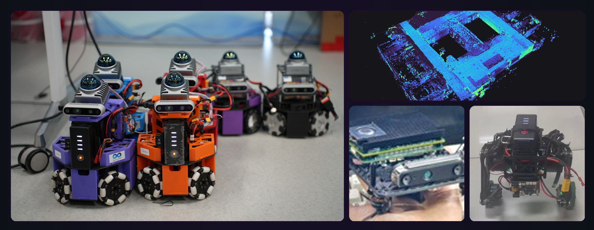
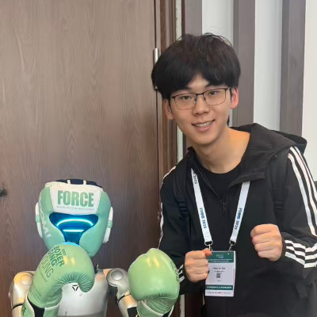
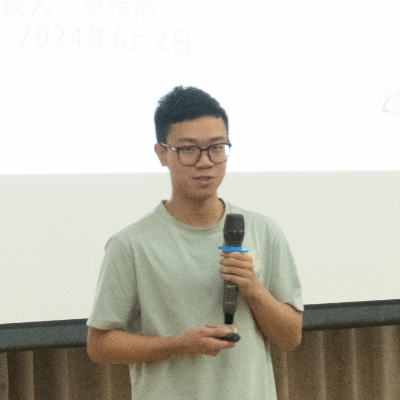
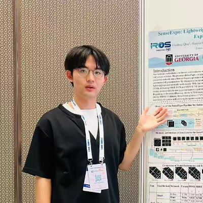
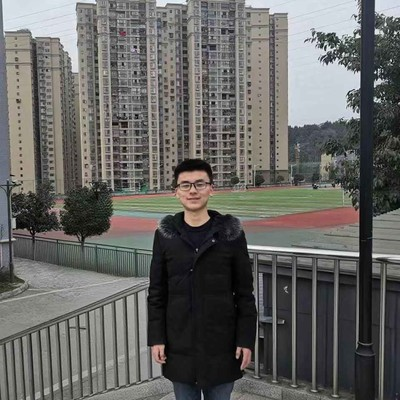
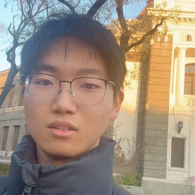
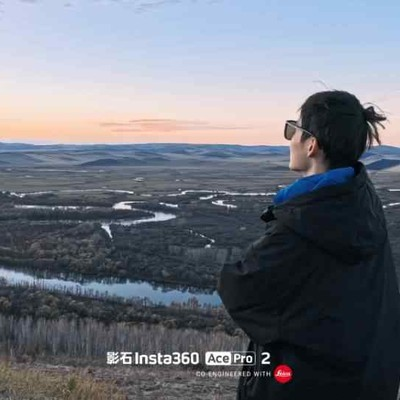
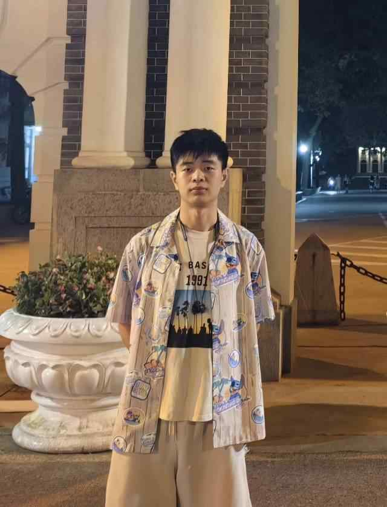
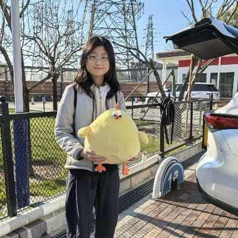
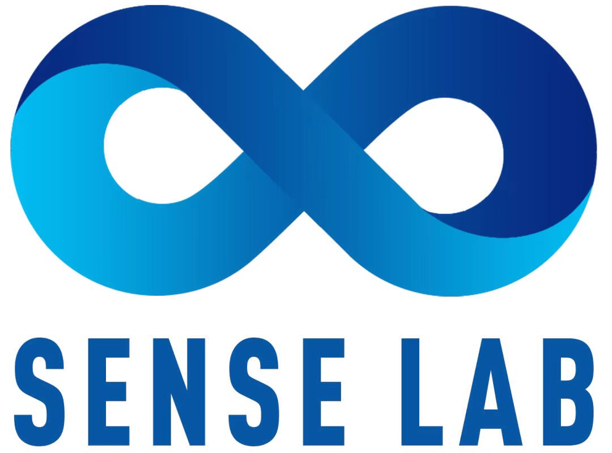

  <h1>⚡️ SenseLabRobo ⚡️</h1>
  <h3>Tsinghua University | 清华大学</h3>

  

    

  

    

  

    
    
  

---

## 🔮 Our Mission

At **SenseLabRobo**, we define the frontier of **Embodied AI**. We don't just build robots; we endow them with the ability to *sense* complex environments, *understand* semantic contexts, and *act* with agility and precision. Our research fuses multi-modal perception with advanced control theories to create intelligent machines that operate in the real world.

 

## 🧠 Core Research Pillars

<table align="center" style="border: none; width: 100%;">
  <tr>
    <td width="33%" align="center" style="border: none; padding: 10px;">
      <h1>👁️</h1>
      <h3>Multi-Modal Perception</h3>
      
Fusing LiDAR, Camera, and IMU data for robust state estimation and semantic mapping in unstructured environments.

    </td>
    <td width="33%" align="center" style="border: none; padding: 10px;">
      <h1>🦵</h1>
      <h3>Agile Locomotion & Control</h3>
      
Developing model-predictive control and reinforcement learning frameworks for dynamic legged and wheeled robots.

    </td>
    <td width="33%" align="center" style="border: none; padding: 10px;">
      <h1>🤖</h1>
      <h3>Embodied AI & Learning</h3>
      
Bridging the gap between simulation and reality (Sim2Real) for autonomous decision-making and manipulation tasks.

    </td>
  </tr>
</table>

 

## 🧬 The Team

Driven by curiosity, united by code. We are a diverse group of researchers at Tsinghua.

<table style="border: 1px solid var(--color-border-muted); background-color: var(--color-canvas-subtle); border-radius: 16px; padding: 20px; width: 95%; margin: auto; box-shadow: 0 5px 20px rgba(0, 0, 0, 0.05);">
  <tr>
    <td align="center" width="200px" valign="top" style="border: none; padding-right: 20px;">
      
    </td>
    <td valign="top" style="border: none;">
      <h2 style="margin-top: 0; margin-bottom: 5px;">Dr. Fei Qiao</h2>
      <b>Principal Investigator / Associate Professor</b> 
      Department of Electronic Engineering, Tsinghua University 
       
      🧠 <b>Research Lead:</b> Edge Embodied Intelligence, Flexible Wearable Device，Near-zero Power Chips，High Energy Efficiency Intelligence System 
      ✉️ <a href="qiaofei@tsinghua.edu.cn">Email Contact</a> | 🌐 <a href="https://web.ee.tsinghua.edu.cn/qiaofei/zh_CN/index.htm">Faculty Homepage</a>
    </td>
  </tr>
</table>

 

<table style="border: 1px solid var(--color-border-muted); background-color: var(--color-canvas-subtle); border-radius: 16px; padding: 20px; width: 95%; margin: auto; box-shadow: 0 5px 20px rgba(0, 0, 0, 0.05);">
  <tr>
    <td align="center" width="200px" valign="top" style="border: none; padding-right: 20px;">
      
    </td>
    <td valign="top" style="border: none;">
      <h2 style="margin-top: 0; margin-bottom: 5px;">Dr. Rong Zhao</h2>
      <b>Postdoctoral Researcher / Lecturer</b> 
      Tsinghua University (Postdoc) &amp; North University of China (Lecturer) 
       
      🧠 <b>Research Focus:</b> Robot Navigation 
      ✉️ <a href="mailto:ZhaoRoy4107@gmail.com">Email Contact</a>
    </td>
  </tr>
</table>

 

### Core Members & Researchers

<table align="center" style="border: none; width: 100%; margin-top: 20px;">
  <tr>
    <td align="center" valign="top" width="25%" style="border: none; padding: 15px;">
      

          
      

       
      <strong style="font-size: 1.1em;">Qian Zhang (Leader)</strong> 
      

        Ph.D. Candidate 
        Tsinghua SIGS, Tsinghua University 
        Focus: Perception & SLAM
        

          <a href="mailto:qian.zhang@email.com" style="text-decoration: none; color: #660099; margin-right: 10px;" title="Email">✉️ Email</a>
          |
          <a href="https://your-homepage.com" target="_blank" style="text-decoration: none; color: #660099; margin-left: 10px;" title="Personal Homepage">🌐 Web</a>
        

      

    </td>
    <td align="center" valign="top" width="25%" style="border: none; padding: 15px;">
      

          
      

       
      <strong style="font-size: 1.1em;">Haohua Que (Collaborator)</strong> 
      

        Ph.D. Student 
        College of Engineering, University of Georgia 
        Focus: Robotic Control
        

          <a href="mailto:haohua.que@email.com" style="text-decoration: none; color: #660099; margin-right: 10px;" title="Email">✉️ Email</a>
          |
          <a href="#" target="_blank" style="text-decoration: none; color: #660099; margin-left: 10px;" title="Personal Homepage">🌐 Web</a>
        

      

    </td>
    <td align="center" valign="top" width="25%" style="border: none; padding: 15px;">
      

          
      

       
      <strong style="font-size: 1.1em;">Haojia Gao</strong> 
      

        Master Student 
        Tsinghua SIGS, Tsinghua University 
        Focus: Embodied Intelligence
        

          <a href="mailto:intelligent@gaohaojia.top" style="text-decoration: none; color: #660099; margin-right: 10px;" title="Email">✉️ Email</a>
          |
          <a href="https://gaohaojia.github.io/index.html" target="_blank" style="text-decoration: none; color: #660099; margin-left: 10px;" title="Personal Homepage">🌐 Web</a>
        

      

    </td>
    <td align="center" valign="top" width="25%" style="border: none; padding: 15px;">
      

          
      

       
      <strong style="font-size: 1.1em;">Weihao Shan</strong> 
      

        Master Student 
        Department of E.E., Tsinghua University 
        Focus: Robotic Chips Design
        

          <a href="mailto:student@email.com" style="text-decoration: none; color: #660099; margin-right: 10px;" title="Email">✉️ Email</a>
          |
          <a href="#" target="_blank" style="text-decoration: none; color: #660099; margin-left: 10px;" title="Personal Homepage">🌐 Web</a>
        

      

    </td>
  </tr>
</table>

### Research Interns

<table align="center" style="border: none; width: 100%; margin-top: 20px;">
  <tr>
    <td align="center" valign="top" width="25%" style="border: none; padding: 15px;">
      

          
      

       
      <strong style="font-size: 1.1em;">Mingkai Liu</strong> 
      

        Master Student 
        School of Software & Microelectronics, Peking University 
        Focus: 3D Reconstruction & Localization
        

          <a href="mailto:qian.zhang@email.com" style="text-decoration: none; color: #660099; margin-right: 10px;" title="Email">✉️ Email</a>
          |
          <a href="https://your-homepage.com" target="_blank" style="text-decoration: none; color: #660099; margin-left: 10px;" title="Personal Homepage">🌐 Web</a>
        

      

    </td>
    <td align="center" valign="top" width="25%" style="border: none; padding: 15px;">
      

          
      

       
      <strong style="font-size: 1.1em;">Yunchao Mo</strong> 
      

        Master Student 
        College of Computer Science and Artificial Intelligence, Southwest Minzu University 
        Focus: Reinforcement Learning
        

          <a href="mailto:1197829412@qq.com" style="text-decoration: none; color: #660099; margin-right: 10px;" title="Email">✉️ Email</a>
          |
          <a href="https://github.com/MoYunchao" target="_blank" style="text-decoration: none; color: #660099; margin-left: 10px;" title="GitHub">🐙 GitHub</a>
        

      

    </td>
    <td align="center" valign="top" width="25%" style="border: none; padding: 15px;">
      

          
      

       
      <strong style="font-size: 1.1em;">Hui Geng</strong> 
      

        Master Student 
        School of Communication and Information Engineering, Chongqing University of Posts and Telecommunications 
        Focus: Multi-Robot Exploration
        

          <a href="mailto:1759550479@qq.com" style="text-decoration: none; color: #660099; margin-right: 10px;" title="Email">✉️ Email</a>
          |
          <a href="https://github.com/huishao-hub" target="_blank" style="text-decoration: none; color: #660099; margin-left: 10px;" title="GitHub">🐙 GitHub</a>
        

      

    </td>
    <td align="center" valign="top" width="25%" style="border: none; padding: 15px;">
      

          
      

       
      <strong style="font-size: 1.1em;">Chengkui Wang</strong> 
      

        Master Student 
        Computer Science and Technology, Tiangong University 
        Focus: 3D Reconstruction & Autonomous Driving Simulation
        

          <a href="mailto:2996679235@qq.com" style="text-decoration: none; color: #660099; margin-right: 10px;" title="Email">✉️ Email</a>
          |
          <a href="https://github.com/wangchengkui" target="_blank" style="text-decoration: none; color: #660099; margin-left: 10px;" title="GitHub">🐙 GitHub</a>
        

      

    </td>
  </tr>
</table>

### Undergraduate Interns

<table align="center" style="border: none; width: 100%; margin-top: 20px;">
  <tr>
    <td align="center" valign="top" width="25%" style="border: none; padding: 15px;">
      

          
      

       
      <strong style="font-size: 1.1em;">Yifan Zhu</strong> 
      

        Undergraduate 
        Xiuzhong College, Tsinghua University 
        

          <a href="mailto:ivanzhu708@gmail.com" style="text-decoration: none; color: #660099; margin-right: 10px;" title="Email">✉️ Email</a>
          |
          <a href="https://github.com/JJchess" target="_blank" style="text-decoration: none; color: #660099; margin-left: 10px;" title="GitHub">🐙 GitHub</a>
        

      

    </td>
    <td align="center" valign="top" width="25%" style="border: none; padding: 15px;">
      

          
      

       
      <strong style="font-size: 1.1em;">Yuyang Song</strong> 
      

        Undergraduate 
        Information and Electronics, Beijing Institute of Technology 
        Focus: Robotics
        

          <a href="mailto:s70735526@163.com" style="text-decoration: none; color: #660099; margin-right: 10px;" title="Email">✉️ Email</a>
          |
          <a href="https://github.com/SUNNYsyy2005" target="_blank" style="text-decoration: none; color: #660099; margin-left: 10px;" title="GitHub">🐙 GitHub</a>
        

      

    </td>
    <td align="center" valign="top" width="25%" style="border: none; padding: 15px;">
      

          
      

       
      <strong style="font-size: 1.1em;">Jiajun Sun</strong> 
      

        Undergraduate 
        School of Mechanical and Electrical Engineering, Shenzhen University 
        Focus: Robotics
        

          <a href="mailto:1924916921@qq.com" style="text-decoration: none; color: #660099; margin-right: 10px;" title="Email">✉️ Email</a>
          |
          <a href="mailto:Jiajuns757@gmail.com" target="_blank" style="text-decoration: none; color: #660099; margin-left: 10px;" title="GitHub">🐙 GitHub</a>
        

      

    </td>
    <td align="center" valign="top" width="25%" style="border: none; padding: 15px;">
      

          
      

       
      <strong style="font-size: 1.1em;">Shanxu Zhao</strong> 
      

        Undergraduate 
        Department of Electronic Engineering, Tsinghua University 
        

          <a href="mailto:zhaosx23@mails.tsinghua.edu.cn" style="text-decoration: none; color: #660099; margin-right: 10px;" title="Email">✉️ Email</a>
          |
          <a href="https://github.com/boundless323" target="_blank" style="text-decoration: none; color: #660099; margin-left: 10px;" title="GitHub">🐙 GitHub</a>
        

      

    </td>
  </tr>
  <tr>
    <td align="center" valign="top" width="25%" style="border: none; padding: 15px;">
      

          
      

       
      <strong style="font-size: 1.1em;">Yannong Wen</strong> 
      

        Undergraduate (Senior) 
        Fan Gongxiu Honors College, Beijing University of Technology 
        

          <a href="mailto:amandawyn2023@gmail.com" style="text-decoration: none; color: #660099; margin-right: 10px;" title="Email">✉️ Email</a>
          |
          <a href="https://github.com/amandawyn" target="_blank" style="text-decoration: none; color: #660099; margin-left: 10px;" title="GitHub">🐙 GitHub</a>
        

      

    </td>
    <td align="center" valign="top" width="25%" style="border: none; padding: 15px;">
      

          
      

       
      <strong style="font-size: 1.1em;">Hoi Ian Au</strong> 
      

        Undergraduate 
        Department of Electronic Engineering, Tsinghua University 
        Focus: Robotics & Agentic Systems
        

          <a href="mailto:qke22@mails.tsinghua.edu.cn" style="text-decoration: none; color: #660099; margin-right: 10px;" title="Email">✉️ Email</a>
          |
          <a href="https://github.com/HoiIanAu" target="_blank" style="text-decoration: none; color: #660099; margin-left: 10px;" title="GitHub">🐙 GitHub</a>
        

      

    </td>
    <td align="center" valign="top" width="25%" style="border: none; padding: 15px;">
    </td>
    <td align="center" valign="top" width="25%" style="border: none; padding: 15px;">
    </td>
  </tr>
</table>

 
 
 

## 📄 Selected Publications

Our research has been published in top-tier robotics and AI venues.

#### Under Review

- **DAC-MACE: Dynamic Attention-driven Context Mixture-of-Experts for Large-Scale Visual Relocalization** `Under Review`

- **SenseExpo: Spatial Exploration and Navigation via Scene Estimation from Expeditious Predictive Updates** `Under Review`

- **GEO: Geometry-Guided Efficient Quantization for Energy-Aware Automotive Perception** `Under Review`

- **ACGSplat: Accelerated 3D Gaussian Scene Regression via RGB and Poses Only** `Under Review`

- **Zero-Shot Semantics-enhanced Autonomous Exploration in Complex Unknown Environments** `Under Review`

- **ST-GRL: Spatiotemporal Cognitive Graph Reinforcement Learning for Multi-Robot Collaborative Exploration** `Under Review`

- **Kinematic-Aware Improved Hippo Optimization with Laplacian Ironing for Swarm-based Path Planning in Cluttered Environments** `Under Review`

- **MotiMem: Motion-Aware Approximate Memory for Energy-Efficient Neural Perception in Autonomous Vehicles** `Under Review`

#### 2025 / 2026

- **MACE: Mixture-of-Experts Accelerated Coordinate Encoding for Large-Scale Scene Localization and Rendering** 🏆 *Best Paper, IROS 2025 Workshop*
  M. Liu, D. Fan, H. Que, H. Gao, X. Liu, S. Peng, M. Lin, S. Gu, R. Ye, W. Qiu, H. Yao, R. Zhang, X. Huang
  *ICRA 2026 (Accepted)* · [arXiv:2510.14251](https://arxiv.org/abs/2510.14251)

- **Wireless Collaborative Inference Acceleration Based on Distillation for Weed Detection and Instance Segmentation**
  R. Li, Y. Mo, R. Zhao, H. Gao, H. Que, L. Mu
  *IROS 2025* · pp. 1847-1854 · IEEE

- **Mapping at First Sense: A Lightweight Neural Network-Based Indoor Structures Prediction Method for Robot Autonomous Exploration**
  H. Gao, H. Que, K. Li, W. Shan, M. Liu, R. Zhao, L. Mu, X. Yang, Q. Wei, F. Qiao
  *IJCNN 2025* · [arXiv:2504.04061](https://arxiv.org/abs/2504.04061)

- **SenseExpo: Lightweight Neural Networks for Efficient Autonomous Exploration and Scene Prediction**
  H. Que, H. Gao, M. Liu, H. Au, H. Yao, F. Qiao
  *IROS 2025 Workshop on Edge AI for Robotics*

#### 2022

- **OCTOANTS: A Heterogeneous Lightweight Intelligent Multi-Robot Collaboration System with Resource-Constrained IoT Devices**
  Q. Zhang, R. Quan, S. Qimuge, P. Xia, J. Wang, X. Zan, F. Wang, C. Chen, Q. Wei, H. Zhao, X. Liu, F. Qiao
  *IROS 2022* · pp. 2556-2563 · IEEE

#### 2020

- **DXSLAM: A Robust and Efficient Visual SLAM System with Deep Features** 📊 *Cited by 193*
  D. Li, X. Shi, Q. Long, S. Liu, W. Yang, F. Wang, Q. Wei, F. Qiao
  *IROS 2020* · pp. 4958-4965 · IEEE

#### 2019

- **A DenseNet Feature-Based Loop Closure Method for Visual SLAM System**
  C. Yu, Z. Liu, X. Liu, F. Qiao, Y. Wang, F. Xie, Q. Wei, Y. Yang
  *ROBIO 2019* · pp. 258-265 · IEEE

#### 2018

- **DS-SLAM: A Semantic Visual SLAM towards Dynamic Environments** 📊 *Cited by 1379*
  C. Yu, Z. Liu, X. Liu, F. Xie, Y. Yang, Q. Wei, Q. Fei
  *IROS 2018* · pp. 1168-1174 · IEEE

#### 2017

- **Multi-Robot Coordination for High-Speed Pick-and-Place Tasks**
  C. Yu, X. Liu, F. Qiao, F. Xie
  *ROBIO 2017* · pp. 1743-1750 · IEEE

 
 

## 🛠️ The SenseLab Tech Stack

We leverage cutting-edge tools to power our research.

### ▸ Platforms & Middleware

  
  
  
  
  

### ▸ Core Languages & Libraries

  
  
  
  
  
  

### ▸ Hardware Focus

  
  
  
  

 
 
 

## 🏛️ Affiliated Organizations

  
  
  
  
  

 

  

  <h3>Innovating at Tsinghua University.</h3>
  
We are always looking for passionate collaborators and students.

  

    <a href="mailto:qiaofei@tsinghua.edu.cn">✉️ Contact Us</a> | 
    <a href="#">📄 Publications</a> | 
    <a href="https://github.com/SenseLabRobo">🐙 GitHub Profile</a>
  </button>
    
  © 2025 SenseLabRobo. All rights reserved.

